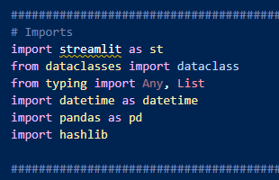
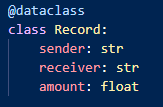
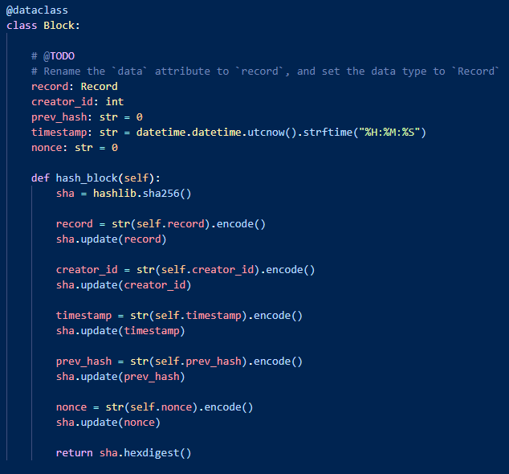
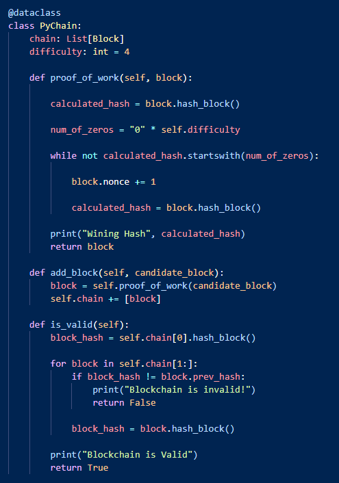
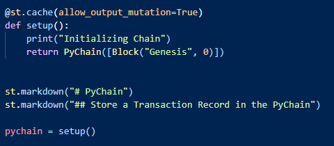
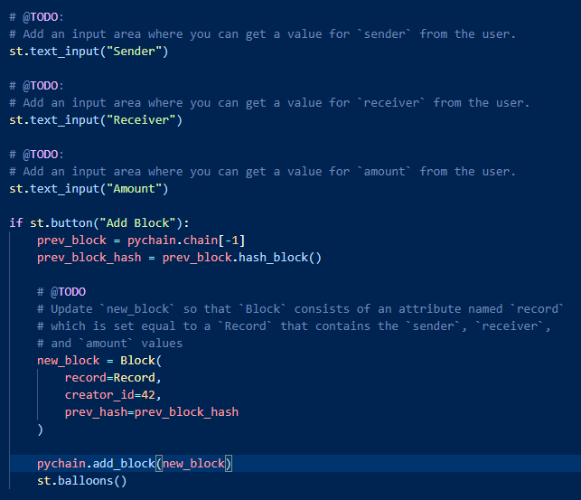
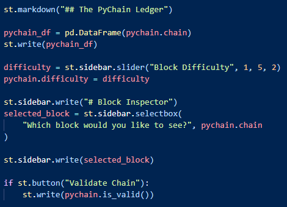
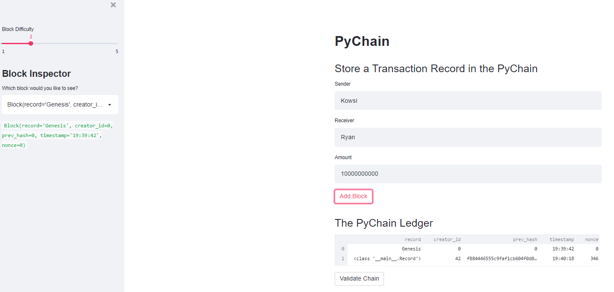

# DeFi

This file blockchain-based ledger system with a user-friendly web interface that allows users to send currency.

First, imports and dependancies are loaded.

Then a class is created called "Record" that stores sender, receiver, and amount data for use later in the code.

Next the "Block" class is created that establishes the current block's details including the inputs from "Record" as well as creator ID, the previous block's hash, the timestamp, and the nonce, then hashes these items.

This is followed by the "Pychain" class that takes in each "Block", establishes proof of work, adds the block to the chain, then verifies and hashes it.

After establishing the above data classes, streamlit code is started and the chain setup function is created and instantiated.

Streamlit code is then added for user inputs to enter the fields established in the "Record" class, as well as a button that initializes the addition of a new block in the chain.

Finally the code adds a dataframe to track the chain and a difficulty slider to adjust hash difficulty on a sidebar along with a dropdown that allows blocks to view them individually.

When app is run through streamlit in the command line it produces the following interface:

